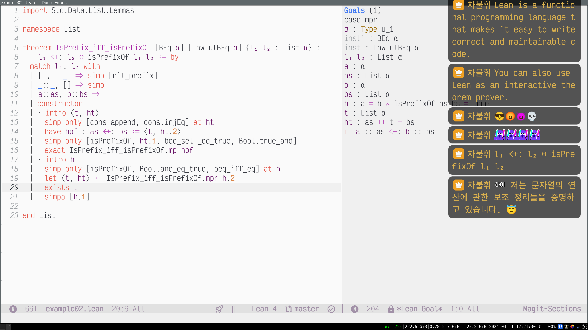

# chzzk-custom-css

English | [한국어[Korean]](./README.ko.md)

This repository contains my custom CSS files for Chzzk's chat window, chat
donation notification, and mission donation notification that should be added to
OBS as browser sources. The base (canvas) resolution should be 3840 × 2160 (4K
UHD).

The file uses two fonts: [Victor Mono][vm] and [Noto Sans CJK KR][noto]. Feel
free to replace them with your favorite fonts.

I enlarged most elements by the scale factor of 2 or 2.5.

## Screenshot

## Usage

Add a browser source to OBS. In the case of Chzzk's chat window, set the browser
source's URL as the link to your Chzzk channel's chat window. Then, add
[`chat_4k_uhd.css`](./chat_4k_uhd.css) to the browser source as your custom CSS.

The URL of your Chzzk chat window is of the following form:

* Notification settings:
  <https://studio.chzzk.naver.com/your-chzzk-channel/notification>

For example, here's the URL of my Chzzk channel:

* My Chzzk channel: <https://chzzk.naver.com/7b15632e2d0107c85168e0b421aa6439>

Therefore, the URL of my Chzzk chat window is as follows:

* My notification settings:
  <https://studio.chzzk.naver.com/7b15632e2d0107c85168e0b421aa6439/notification>

## Files and directories

* [`chat_4k_uhd.css`](./chat_4k_uhd.css): Chzzk's chat window.
* [`donation_4k_uhd.css`](./donation_4k_uhd.css): Chzzk's chat donation
  notification.
* [`mission_4k_uhd.css`](./mission_4k_uhd.css): Chzzk's mission donation
  notification.
* Documentation: [`docs`](./docs)
  * English: [`en`](./docs/en)
  * Korean: [`ko`](./docs/ko)

## Documentation

I use [OmegaT][omt] to translate English documentation into Korean. The OmegaT
project is in the [`docs`](./docs) directory. You need to install the [Okapi
filters plugin for OmegaT][okapi] to make OmegaT parse Markdown files.

Since the `README.md` file isn't in the `docs/en` directory, I had to create a
symbolic link to it there. Whenever I use OmegaT to create the translated file,
I copy the Korean translation of `README.md` to the root directory and rename it
`README.ko.md`.

## License

This work is in the [public domain](./LICENSE).

[vm]: https://rubjo.github.io/victor-mono/
[noto]: https://github.com/notofonts/noto-cjk/tree/main/Sans#downloading-noto-sans-cjk
[omt]: https://omegat.org/
[okapi]: https://okapiframework.org/wiki/index.php/Okapi_Filters_Plugin_for_OmegaT
